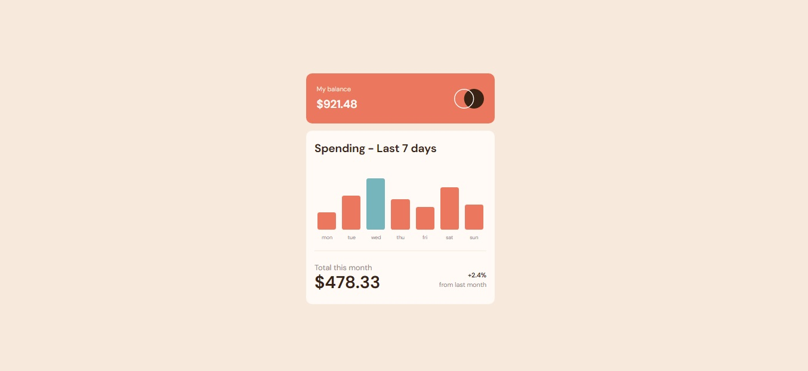

# Frontend Mentor - Expenses chart component solution

This is a solution to the [Expenses chart component challenge ](https://www.frontendmentor.io/challenges/expenses-chart-component-e7yJBUdjwt).

## Table of contents

- [Overview](#overview)
  - [The challenge](#the-challenge)
  - [Screenshot](#screenshot)
  - [Links](#links)
- [My process](#my-process)
  - [Built with](#built-with)
  - [What I learned](#what-i-learned)
  - [Continued development](#continued-development)
  - [Useful resources](#useful-resources)
- [Author](#author)
- [Acknowledgments](#acknowledgments)


## Overview

### The challenge

Users should be able to:

- View the bar chart and hover over the individual bars to see the correct amounts for each day
- See the current day’s bar highlighted in a different colour to the other bars
- View the optimal layout for the content depending on their device’s screen size
- See hover states for all interactive elements on the page
- **Bonus**: Use the JSON data file provided to dynamically size the bars on the chart

### Screenshot



### Links

- Solution URL: [Add solution URL here](https://your-solution-url.com)
- Live Site URL: [Add live site URL here](https://your-live-site-url.com)

## My process
no process just keep going when you get stack.
### Built with

- Semantic HTML5 markup
- CSS custom properties
- Flexbox
- CSS Grid
- Mobile-first workflow
- [React](https://reactjs.org/) - JS library
- [Next.js](https://nextjs.org/) - React framework
- [Styled Components](https://styled-components.com/) - For styles
- [Modern css reset](https://piccalil.li/blog/a-modern-css-reset/) - piccalil

### What I learned


```html
        <div class="graphe">
            <div class="column-container" >
                <div class="column col-1" id="col1" href="#"></div>
                <div class="column col-2" id="col2" href="#"></div>
                <div class="column col-3" id="col3" href="#"></div>
                <div class="column col-4" id="col4" href="#"></div>
                <div class="column col-5" id="col5" href="#"></div>
                <div class="column col-6" id="col6" href="#"></div>
                <div class="column col-7" id="col7" href="#"></div>
            </div>

            <div class="days-container">
                <ul>
                    <li class="days day-1" id="day1">mon</li>
                    <li class="days day-2" id="day2">tue</li>
                    <li class="days day-3" id="day3">wed</li>
                    <li class="days day-4" id="day4">thu</li>
                    <li class="days day-5" id="day5">fri</li>
                    <li class="days day-6" id="day6">sat</li>
                    <li class="days day-7" id="day7">sun</li>
                </ul>
            </div>
        </div> <!-- graphe-->
```
```css
@media (hover: hover){
    .col-1::after,
    .col-2::after,
    .col-3::after,
    .col-4::after,
    .col-5::after,
    .col-6::after,
    .col-7::after{
        content: attr(title);
        position: absolute;
        display: none;
        background-color: var(--neutral-700);
        color: rgb(255, 255, 255);
        width: max-content;
        font-family: var(--ff-primary);
        font-weight: 700;
        border-radius: .2rem;
        font-size: .7rem;
        padding: .4em .5em;
        top: -1rem;
        left: 50%;
        transform: translate(-50%,-50%);
    }
    .col-1:hover::after,
    .col-2:hover::after,
    .col-3:hover::after,
    .col-4:hover::after,
    .col-5:hover::after,
    .col-6:hover::after,
    .col-7:hover::after  {
        display: block;
        z-index: 1;
    }

}
```
```js

// just the last 7 days
function lastSevenDays(arr){
  objAppend={'day':'***', 'amount':0};
  if (arr.length > 7) {
    const M=arr.length-7;
    for(let i=0 ; i < M ; i++) {
      arr.shift();
    }
  }else if (arr.length < 7) {
    const M=7-arr.length;
    for(let i=0 ; i < M ; i++) {
      arr.push(objAppend)
    }
  }
  return arr;
}


// claculate the height of each column
 function heightCalc(amount, maxAmount,colHeight){
  return (amount*colHeight)/maxAmount
}

//get amounts
function getAmounts(data){
  const amounts=[];
  for(let i=0; i<data.length ; i++){
    amounts.push(data[i].amount)
  }
  return amounts;
}
// clac max of the seven days
function maxAmount(data){
  const amounts=getAmounts(data);
  max=-Infinity;

  for(let element of amounts){
    if (max < element){
      max=element
    }
  }
  return max;
}

// put every day of the last 7 days in the graphe label
function putDaysInLabel(data){
  data=lastSevenDays(data);
  for(let i=0 ; i < 7 ; i++){
    var d = i+1;
    var day='day' + d;
    document.getElementById(day).innerHTML=data[i].day;
  }
}
// clac size of column and the label content
function heightArrayCalc(data){
  var heights=[];
  const maxOfAmounts=maxAmount(data);
  const amounts=getAmounts(data);
  for(let element of amounts){
    if (element === 0 || element==='0' || element < 0){
      heights.push(0);
    } else {
      let h = heightCalc(element,maxOfAmounts,6);
      heights.push(h)

    }
  }
  return heights;
}

// put every size in column
function putComlumnSizes(heights){
  for (let i=0; i<heights.length ; i++){
    let r=i+1
    let colId= 'col'+r;
    document.getElementById(colId).style.height=heights[i]+'rem';
  }
}

// change the subTitle element
function changeVarTitle(columnTitles){
  for(let i=0 ; i < columnTitles.length ; i++){
    let r=i+1;
    let colId='col' + r;
    document.getElementById(colId).title='$'+columnTitles[i];
  }
}

//get index of the max
function getIndexOfMax(data) {
  const amounts=getAmounts(data);
  let max=-Infinity;
  let d=0;

  for(let element of amounts){
    if (max < element){
      max=element
    }
  }
  return amounts.indexOf(max);
}
// change the color of the max column
function changeColorOfMaxColumn(data){
  const index=getIndexOfMax(data) + 1;
  const colId= 'col' + index;
  document.getElementById(colId).style.backgroundColor='var(--primary-100)';
  document.getElementById(colId).addEventListener("mouseover",function() { mouseOver(colId)});
  document.getElementById(colId).addEventListener("mouseout", function() {mouseOut(colId)});
}


function mouseOver(colId) {
  document.getElementById(colId).style.backgroundColor = 'var(--primary-50)';
}

function mouseOut(colId) {
  document.getElementById(colId).style.backgroundColor = 'var(--primary-100)';
}
```

### Continued development

I think this project help me so much specialy in the side of the statistics, its gonna help me in the future when im ganna make my own web site after finishing my study.


### Useful resources

- [W3schools](https://www.w3schools.com/) - This helped me for javaScript eventListener. I really liked this pattern and will use it going forward.
- [stackoverflow](https://stackoverflow.com/) - this website help me on the javascript when i get stock.
## Author

- Website - [Mohamed Sagou](https://github.com/medsagou)
- Frontend Mentor - [@medsagou](https://www.frontendmentor.io/profile/medsagou)
- Twitter - [@sagoumohamed](https://www.twitter.com/sagoumohamed)

## Acknowledgments

Never give up, and the "javaScript easy" :|.
